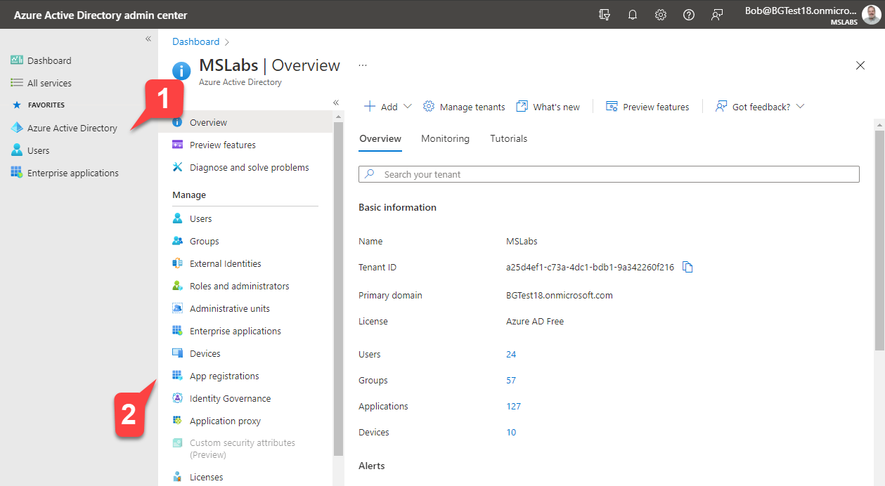
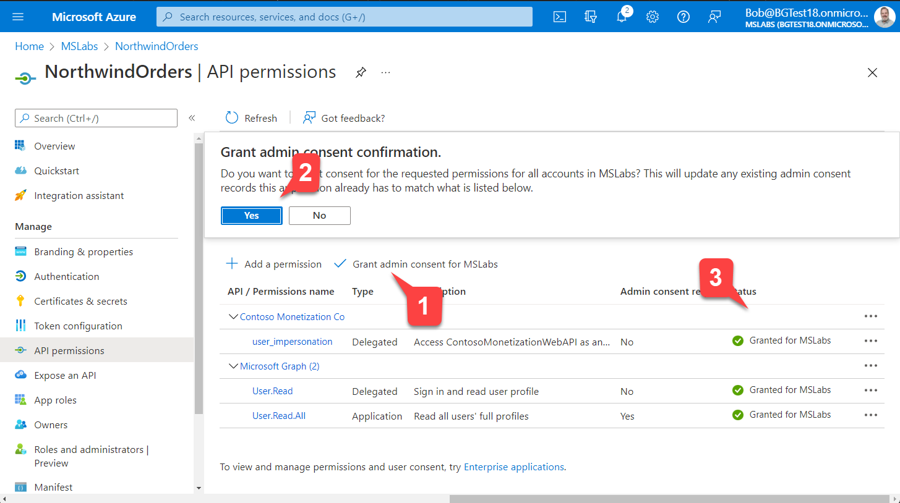

## Lab A08: Set up and integrate with licensing sample and App Source simulator

This lab is part of Path A, which begins with a Northwind Orders application that already uses Azure AD.

* [Lab A01: Setting up the application with Azure AD](./Lab-A01.md)
* Lab A02: (there is no lab A02; please skip to A03)
* [Lab A03: Creating a Teams app with Azure ADO SSO](./Lab-A03.md)
* [Lab A04: Teams styling and themes](./Lab-A04.md)
* [Lab A05: Add a Configurable Tab](./Lab-A05.md)
* [Lab A06: Add a Messaging Extension](./Lab-A06.md)
* [Lab A07: Add a Task Module and Deep Link](./Lab-A07.md)
* [Lab A08: Add support for selling your app in the Microsoft Teams store](./Lab-A08.md) (📍You are here)

In this lab you will learn to:

- Deploy the App Source simulator and sample SaaS fulfillment and licensing service in Microsoft Azure so you can test it
- Observe the interactions between App Source and a SaaS landing page in a simulated environment
- Connect the Northwind Orders application to the sample SaaS licensing service to enforce licenses for Microsoft Teams users

### Features

- App Source simulator where a customer can "purchase" a subscription to your application
- Sample web service that fulfills this purchase and manages licenses for Microsoft Teams users to use the Northwind Orders application
- Northwind Orders application checks to ensure Microsoft Teams users are licensed or displays an error page

### Exercise 1: Download and install the monetization sample

> insert Rabia's exercises here

### Exercise n: Grant the Northwind Orders app permission to call the licensing service in Azure

In this exercise and the next, you will connect the Northwind Orders application to the sample licensing service you just installed. This will allow you to simulate purchasing the Northwind Orders application in the App Source simulator and enforcing the licenses in Microsoft Teams.

The licensing web service is secured using Azure AD, so in order to call it the Northwind Orders app will acquire an access token to call the licenisng service on behalf of the logged in user.

#### Step 1: Return to the Northwind Orders app registration

Return to the [Azure AD admin portal](https://aad.portal.azure.com/) and make sure you're logged in as the administrator of your development tenant. Click "Azure Active Directory" 1️⃣ and then "App Registrations" 2️⃣.

Select the app you registered earlier to view the application overview.

#### Step 2: Add permission to call the licensing application

In the left navigation, click "API permissions" 1️⃣ and then "+ Add a permission" 2️⃣.

In the flyout, select the "My APIs" tab 1️⃣ and then find the licensing service you installed earlier in this lab and click on it. By default, it will be called the "Contoso Monetization Code Sample Web API" 2️⃣.

Now select "Delegated permissions" 1️⃣ and the one scope exposed by the licensing web API, "user_impersonation", will be displayed. Check this permission 2️⃣ and click "Add permissions" 3️⃣.

#### Step 3: Consent to the permission

You have added the permission but nobody has consented to it. Fortunately you're an administrator and can grant your consent from this same screen! Just click the "Grant admin consent for <tenant>" button 1️⃣ and then agree to grant the consent 2️⃣. When this is complete, the message "Granted for <tenant>" 3️⃣ should be displayed for each permission.

### Exercise n+1: Update the Northwind Orders app to call the licensing service in Azure

In lab A01 (WILL BE B03 ON OTHER TRACK) 

API's:
- Activate a subscription
- Get list of all subscriptions
- Get subscription
- List available plans
- Change the plan on the subscription
- Change the quantity of seats on the SaaS subscription
- Cancel a subscription

Webhooks (SaaS subscription is in Subscribed status):
- ChangePlan
- ChangeQuantity
- Renew
- Suspend
- Unsubscribe

Webhooks (SaaS subscription is in Suspended status):
- Reinstate
- Unsubscribe

### Exercise n+1: Examine the Application Code

TO BE PROVIDED

### Known issues

For the latest issues, or to file a bug report, see the [github issues list](https://github.com/OfficeDev/TeamsAppCamp1/issues) for this repository.

### References

* [Create a configuration page](https://docs.microsoft.com/en-us/microsoftteams/platform/tabs/how-to/create-tab-pages/configuration-page)

